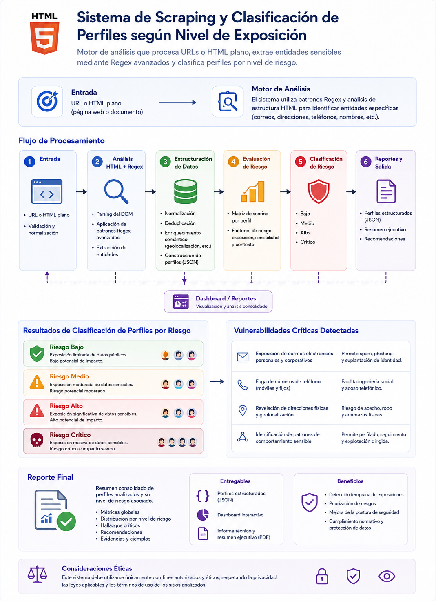

# 🛡️ AI Scrapper Vulnerabilities API

Es un motor de análisis inteligente diseñado para la **detección automatizada de exposición de datos sensibles y auditoría de infraestructura**. A través de técnicas de web scraping, Procesamiento de Lenguaje Natural (NLP) y clasificación basada en riesgos, identifica perfiles y vulnerabilidades en sitios web o documentos HTML.

## 🚀 Arquitectura del Sistema
El flujo de trabajo se divide en tres etapas críticas:

1. 🔍 **Motor de Análisis & Scrapper:** Procesa la entrada (URL o HTML), utiliza patrones Regex avanzados y análisis semántico para extraer datos de usuarios (emails, teléfonos, alias, fechas), limpiar el ruido del DOM y consolidar perfiles únicos.
2. 💻 **Fingerprinting de Infraestructura:** Inspecciona bloques `<script>` para descubrir tecnologías/frameworks utilizados y extraer de forma literal tokens, secretos o variables de entorno expuestas.
3. ⚖️ **RiskScorer:** Aplica una matriz de scoring estricta sobre los datos extraídos y las variables de entorno, categorizando la exposición en niveles: Mínimo, Bajo, Medio o Alto.

## Diagrama


---

## 🛠️ Setup e Instalación

Para poner en marcha el entorno de desarrollo:

### 1. Clonar y preparar entorno
```bash
# Instalar dependencias
pip install -r requirements.txt

```

### 2. Ejecutar la API

Levanta el servidor utilizando Uvicorn para desarrollo con recarga automática:

```bash
uvicorn src.api.main:app --reload

```

### 3. Acceso a Documentación

Swagger UI para probar endpoints:
http://localhost:8000/docs

---

## 🔌 Endpoints de la API

La API expone los siguientes endpoints:

### 🌐 Scrapper Web

* **POST `/escanear-web**`: Escanea una URL en vivo detectando información sensible y tecnologías utilizadas.
* **POST `/escanear-html**`: Escanea un archivo HTML cargado (`UploadFile`) detectando información sensible y tecnologías utilizadas.

### ⚖️ Risk Scorer

* **POST `/evaluar-perfil**`: Evalúa el nivel de riesgo de un perfil básico obtenido por el scraping sin contexto adicional.
* **POST `/evaluar-perfil-contexto**`: Evalúa el nivel de riesgo de un perfil cruzando los datos del scraper con información de contexto interna (hábitos y configuraciones de seguridad booleanas).

### ⚙️ Scrapper y Risk Scorer (Flujo Completo)

* **POST `/escanear-perfiles-html**`: Escanea un archivo HTML detectando información sensible y tecnologías utilizadas, y luego evalúa automáticamente el nivel de riesgo individual de cada perfil encontrado en el documento.

---

## 📊 Niveles de Riesgo Detectados

El **RiskScorer** classifies automáticamente los hallazgos según el puntaje total de exposición:

* ✅ **Riesgo Mínimo / Bajo**: Exposición muy limitada de datos públicos o datos antigüos.
* ⚠️ **Riesgo Medio**: Presencia de datos sensibles correlacionados con impacto moderado.
* 🚫 **Riesgo Alto / Crítico**: Exposición masiva de información personal cruzada o presencia de privilegios críticos comprometidos.

---

## ⚙️ Lógicas de Ponderación del RiskScorer

El cálculo del scoring final de riesgo no es puramente lineal, sino que implementa tres lógicas avanzadas de correlación de seguridad para modelar amenazas reales:

### 1. 🕒 Time-Decay (Mitigación por Antigüedad)

La vigencia de la información es un factor clave en la explotación de una vulnerabilidad. El sistema calcula la diferencia entre la fecha actual y las fechas halladas en el perfil:

* **Datos Recientes (<= 30 días):** Actúan como un penalizador que incrementa el riesgo, ya que los vectores de ataque (ej. contraseñas o teléfonos) están frescos y muy probablemente activos.
* **Datos Viejos (> 3 años):** Aplican una mitigación temporal restando puntos al score total, dado que la probabilidad de obsolescencia reduce la superficie de ataque efectiva.

### 2. 🗂️ Doxing Agrupado (Densidad y Correlación de Datos)

Un atacante es mucho más peligroso cuando posee múltiples datos cruzados de una misma persona. El **RiskScorer** evalúa la acumulación de entidades expuestas dentro de un mismo bloque lógico:

* Si el perfil expone simultáneamente nombre, múltiples correos, teléfonos y direcciones físicas, se dispara una regla de **Doxing Agrupado** que añade un multiplicador o puntaje crítico extra. La agregación de datos facilita la suplantación de identidad completa del objetivo.

### 3. 🎯 Roles Expuestos (Impacto de Spear-Phishing)

No todas las cuentas tienen el mismo valor estratégico dentro de una organización. El sistema mapea dinámicamente los cargos detectados contra una lista de roles clave:

* La presencia de términos como *Administrador, DevOps, CEO o Soporte de Sistemas* eleva automáticamente el perfil a un nivel de riesgo drásticamente superior. Esto responde a que estos roles representan los objetivos principales de campañas de **Spear-Phishing**, donde el compromiso de sus credenciales individuales podría otorgar acceso total a la infraestructura interna de la compañía.

---

> ⚖️ Consideraciones Éticas: Este sistema está destinado exclusivamente a un trabajo de investigación final de la materia Seguridad Informática de la Universidad Nacional de Quilmes.
